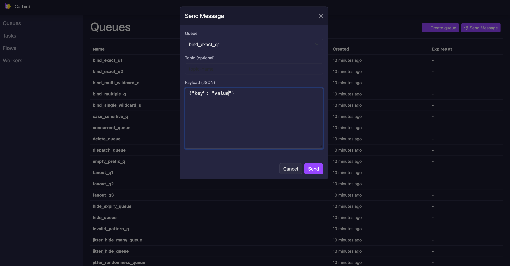

[](https://pkg.go.dev/github.com/ugent-library/catbird)
[](LICENSE)
[](https://golang.org)
[](https://goreportcard.com/report/github.com/ugent-library/catbird)


# Catbird

A PostgreSQL-powered message queue and task execution engine. Catbird brings reliability and simplicity to background job processing by using your database as the single source of truth—no extra services to manage, just your database coordinating everything.

## Why Catbird?

- **Exactly-once execution within a timeframe**: PostgreSQL ensures each message is processed exactly once per visibility window, preventing duplicates even with multiple workers. If a worker crashes, the message becomes visible again after the configured timeout and can be retried.
- **Database as coordinator**: PostgreSQL manages message distribution, deduplication, and state. Scale workers horizontally; the database handles the rest.
- **Type-safe tasks**: Generic Go handlers with automatic JSON marshaling for inputs and outputs.
- **Flexible workflows**: Multi-step DAGs with dependency tracking and cascading data between steps.
- **Built-in persistence**: All state (queues, tasks, flows, runs) lives in PostgreSQL for auditability and recovery.
- **Worker management**: Simple worker lifecycle with graceful shutdown, configurable concurrency, and built-in retries.
- **Resiliency features**: Handler retries with backoff, optional circuit breaker protection, and PostgreSQL retry logic for transient errors.
- **Dashboard**: Web UI to trigger task/flow runs, monitor progress in real-time, and view results.

## Quick Start

### Basic Queue

```go
ctx := context.Background()
client := catbird.New(conn)

// Create a queue
err := client.CreateQueue(ctx, "my-queue")

// Create a queue that expires after 1 hour and is unlogged for better performance
err = client.CreateQueueWithOpts(ctx, "temp-queue", catbird.QueueOpts{
    ExpiresAt: time.Now().Add(1 * time.Hour),
    Unlogged:  true, // Faster but not crash-safe; useful for transient work
})

// Send a message
err = client.Send(ctx, "my-queue", map[string]any{
    "user_id": 123,
    "action":  "process",
})

// Send a message with delayed delivery (available in 5 minutes)
err = client.SendWithOpts(ctx, "my-queue", map[string]any{
    "type":    "reminder",
    "user_id": 456,
}, catbird.SendOpts{
    DeliverAt: time.Now().Add(5 * time.Minute),
})

// Send a message with deduplication to prevent duplicates
err = client.SendWithOpts(ctx, "my-queue", map[string]any{
    "order_id": 789,
    "action":   "process",
}, catbird.SendOpts{
    DeduplicationID: "order-789-process",
})

// Read messages (hidden from other readers for 30 seconds)
messages, err := client.Read(ctx, "my-queue", 10, 30*time.Second)
for _, msg := range messages {
    // Process message
    client.Delete(ctx, "my-queue", msg.ID)
}
```

### Topic-Based Routing

```go
// Create queues
err := client.CreateQueue(ctx, "user-events")
err = client.CreateQueue(ctx, "audit-log")

// Bind queues to topic patterns
// Exact match
err = client.Bind(ctx, "user-events", "events.user.created")

// Single-token wildcard (? matches exactly one token)
err = client.Bind(ctx, "user-events", "events.?.updated")
// Matches: events.user.updated, events.order.updated

// Multi-token wildcard (* matches one or more tokens at end)
err = client.Bind(ctx, "audit-log", "events.*")
// Matches: events.user.created, events.order.shipped, etc.

// Dispatch a message to all matching queues
err = client.Dispatch(ctx, "events.user.created", map[string]any{
    "user_id": 123,
    "email":   "user@example.com",
})
// Message is delivered to both "user-events" (exact) and "audit-log" (wildcard)

// Unbind a pattern
err = client.Unbind(ctx, "user-events", "events.?.updated")
```

Wildcard rules:
- `?` matches a single token (e.g., `events.?.created` matches `events.user.created`)
- `*` matches one or more tokens at the end (e.g., `events.user.*` matches `events.user.created.v1`)
- `*` must appear as `.*` at the end of the pattern
- Tokens are separated by `.` and can contain `a-z`, `A-Z`, `0-9`, `_`, `-`

### Task Execution

```go
// Define the task
task := catbird.NewTask("send-email", func(ctx context.Context, input EmailRequest) (EmailResponse, error) {
    // Send email logic here
    return EmailResponse{SentAt: time.Now()}, nil
},
    catbird.WithConcurrency(5), // Allow up to 5 concurrent executions
    catbird.WithMaxRetries(3), // Retry 3 times
    catbird.WithBackoff(500*time.Millisecond, 10*time.Second), // Exponential backoff between 500ms and 10s
    catbird.WithCircuitBreaker(5, 30*time.Second), // Open after 5 consecutive failures
)

// Start a worker that handles the send-email task
worker, err := client.NewWorker(ctx, catbird.WithTask(task))
go worker.Start(ctx)

// Run the task
handle, err := client.RunTask(ctx, "send-email", EmailRequest{
    To:      "user@example.com",
    Subject: "Hello",
})

// Run a task with deduplication to prevent duplicate executions
handle, err = client.RunTaskWithOpts(ctx, "send-email", EmailRequest{
    To:      "user@example.com",
    Subject: "Welcome",
}, catbird.RunTaskOpts{
    DeduplicationID: "email-user123-welcome",
})

// Get result
var result EmailResponse
err = handle.WaitForOutput(ctx, &result)

// Schedule a task to run periodically (using cron syntax)
worker, err = client.NewWorker(ctx,
    catbird.WithTask(sendEmailsTask),
    catbird.WithScheduledTask("send-emails", "@hourly", nil), // Run every hour
)
go worker.Start(ctx)
```

Catbird includes multiple resiliency layers for transient failures. Handlers can retry with [WithMaxRetries](https://pkg.go.dev/github.com/ugent-library/catbird#WithMaxRetries) and exponential jittered backoff via [WithBackoff](https://pkg.go.dev/github.com/ugent-library/catbird#WithBackoff), and you can wrap external calls with a circuit breaker using [WithCircuitBreaker](https://pkg.go.dev/github.com/ugent-library/catbird#WithCircuitBreaker) to avoid cascading outages. On the infrastructure side, PostgreSQL operations are issued with retry logic for transient errors to keep workers making progress even if the database briefly hiccups.

### Workflow (Multi-Step Flow)

Flow structure:
```
     validate
     /      \
  charge   check
     \      /
       ship
```

```go
// Define the flow with steps and dependencies
flow := catbird.NewFlow("order-processing",
    catbird.InitialStep("validate", func(ctx context.Context, order Order) (bool, error) {
        // Validate order
        return true, nil
    }),
    catbird.StepWithOneDependency("charge",
        catbird.Dependency("validate"),
        func(ctx context.Context, order Order, validated bool) (int, error) {
            // Charge payment and return amount
            return 9999, nil
        }),
    catbird.StepWithOneDependency("check",
        catbird.Dependency("validate"),
        func(ctx context.Context, order Order, validated bool) (bool, error) {
            // Inventory check
            return true, nil
        }),
    catbird.StepWithTwoDependencies("ship",
        catbird.Dependency("charge"),
        catbird.Dependency("check"),
        func(ctx context.Context, order Order, chargeAmount int, inStock bool) (string, error) {
            // Ship order only if charged and in stock
            return "TRK123", nil
        }),
)

// Start a worker that handles the flow
worker, err := client.NewWorker(ctx,
    catbird.WithFlow(flow),
)
go worker.Start(ctx)

// Schedule a flow to run periodically (using cron syntax)
worker, err = client.NewWorker(ctx,
    catbird.WithFlow(flow),
    catbird.WithScheduledFlow("order-processing", "0 2 * * *", nil), // Run daily at 2 AM
)
go worker.Start(ctx)

// Run the flow
handle, err := client.RunFlow(ctx, "order-processing", myOrder)

// Run a flow with deduplication to prevent duplicate executions
handle, err = client.RunFlowWithOpts(ctx, "order-processing", myOrder, catbird.RunFlowOpts{
    DeduplicationID: "order-12345-processing",
})

// Get combined results from all steps
var results map[string]any
err = handle.WaitForOutput(ctx, &results)
// results contains output from all steps: validate, charge, check, ship
```

## Naming Rules

- **Queue, task, flow, and step names**: Lowercase letters, digits, and underscores only (`a-z`, `0-9`, `_`). Max 58 characters. Step names must be unique within a flow.
- **Topics/Patterns**: Letters (upper/lower), digits, dots, underscores, and hyphens (`a-z`, `A-Z`, `0-9`, `.`, `_`, `-`, plus wildcards `?`, `*`).

## Using the PostgreSQL API Directly

Catbird is built on PostgreSQL functions, so you can use the API directly from any language or tool with PostgreSQL support (psql, Python, Node.js, Ruby, etc.).

### Queues

```sql
-- Create a queue
SELECT cb_create_queue(name => 'my_queue', expires_at => null, unlogged => false);

-- Send a message
SELECT cb_send(queue => 'my_queue', payload => '{"user_id": 123, "action": "process"}'::jsonb, 
               topic => null, deduplication_id => null, deliver_at => null);

-- Send with deduplication and delayed delivery
SELECT cb_send(queue => 'my_queue', payload => '{"order_id": 789}'::jsonb,
               topic => null, deduplication_id => 'order-789', deliver_at => now() + '5 minutes'::interval);

-- Dispatch to topic-bound queues
SELECT cb_dispatch(topic => 'events.user.created', payload => '{"user_id": 456}'::jsonb,
                   deduplication_id => 'user-456-created', deliver_at => null);

-- Read messages (with 30 second visibility timeout)
SELECT * FROM cb_read(queue => 'my_queue', limit => 10, hide_for => 30);

-- Delete a message
SELECT cb_delete(queue => 'my_queue', id => 1);

-- Bind queue to topic pattern
SELECT cb_bind(queue_name => 'user_events', pattern => 'events.user.*');
SELECT cb_unbind(queue_name => 'user_events', pattern => 'events.user.*');
```

### Tasks

```sql
-- Create a task definition
SELECT cb_create_task(name => 'send_email');

-- Run a task
SELECT * FROM cb_run_task(name => 'send_email', input => '{"to": "user@example.com"}'::jsonb, 
                          deduplication_id => null);

-- Run a task with deduplication
SELECT * FROM cb_run_task(name => 'send_email', input => '{"to": "user@example.com"}'::jsonb, 
                          deduplication_id => 'email-user123-welcome');
```

### Workflows

```sql
-- Create a flow definition
SELECT cb_create_flow(name => 'order_processing', steps => '[
  {"name": "validate"},
  {"name": "charge", "depends_on": [{"name": "validate"}]},
  {"name": "ship", "depends_on": [{"name": "charge"}]}
]'::jsonb);

-- Run a flow
SELECT * FROM cb_run_flow(name => 'order_processing', input => '{"order_id": 123}'::jsonb,
                          deduplication_id => null);

-- Run a flow with deduplication
SELECT * FROM cb_run_flow(name => 'order_processing', input => '{"order_id": 123}'::jsonb,
                          deduplication_id => 'order-123-processing');
```

### Monitoring Task and Flow Runs

You can query task and flow run information directly:

```sql
-- List recent task runs (replace send_email with your task name)
SELECT id, deduplication_id, status, input, output, error_message, started_at, completed_at, failed_at
FROM cb_t_send_email
ORDER BY started_at DESC
LIMIT 20;

-- Get flow run (replace order_processing with your flow name)
SELECT id, deduplication_id, status, input, output, error_message, started_at, completed_at, failed_at
FROM cb_f_order_processing
WHERE id = $1;
```

## Dashboard Preview

<p align="center">
  
</p>
<p align="center">
  
</p>
<p align="center">
  
</p>

## Documentation

- **[Go API Documentation](https://pkg.go.dev/github.com/ugent-library/catbird)**: Complete reference for all public types and functions
- **[Copilot Instructions](/catbird-instructions.md)**: Architecture overview and developer guidance

## Acknowledgments

SQL code is taken from or inspired by the excellent [pgmq](https://github.com/pgmq) and [pgflow](https://github.com/pgflow-dev/pgflow) projects.
